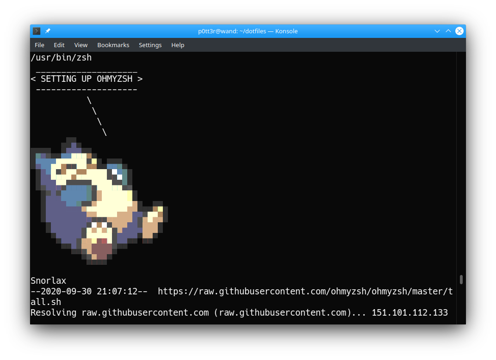
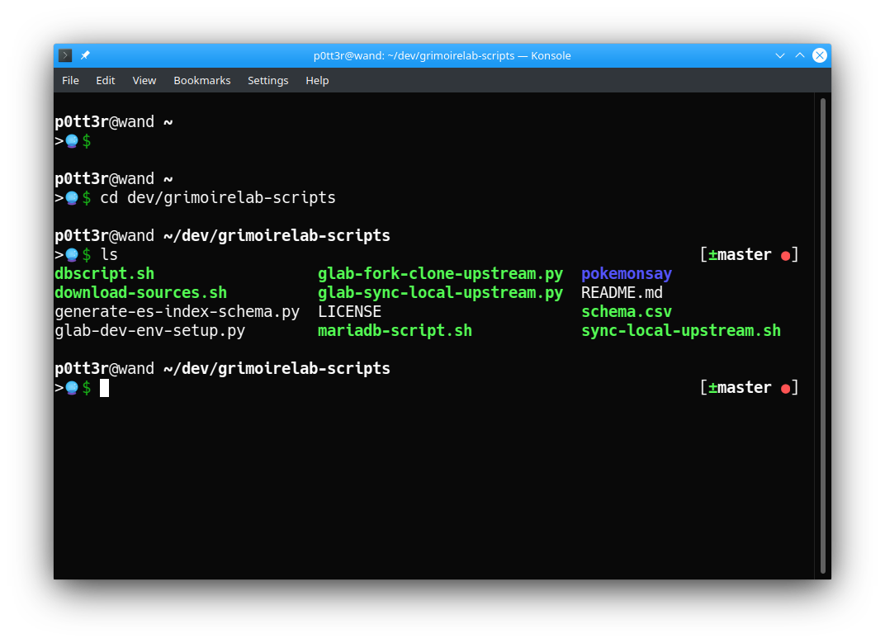

# dotfiles

personal configuration files and a script to install everything :rice_ball:




Read more about it here, https://www.thegeekyway.com/what-are-dotfiles/.

## How To Use

Run this script on a fresh installation of the system.
```
p0tt3r@wand ~ >🔮$ sh -c "$(wget -O- https://raw.githubusercontent.com/vchrombie/dotfiles/master/install.sh)"
```

You can fork this repo and create your own version.


## Thanks

- Inspired from [dnivra/dotfiles](https://github.com/dnivra/dotfiles).
- This theme is based on [Bureau](https://github.com/robbyrussell/oh-my-zsh/wiki/Themes#bureau) and modified.
- Logging support by [possatti/pokemonsay](https://github.com/possatti/pokemonsay).
